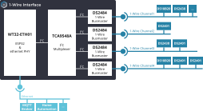
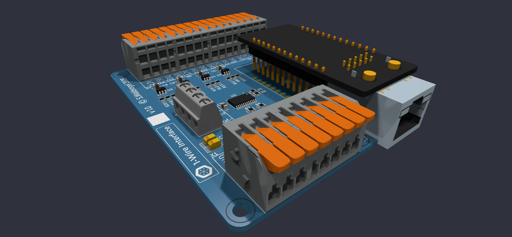
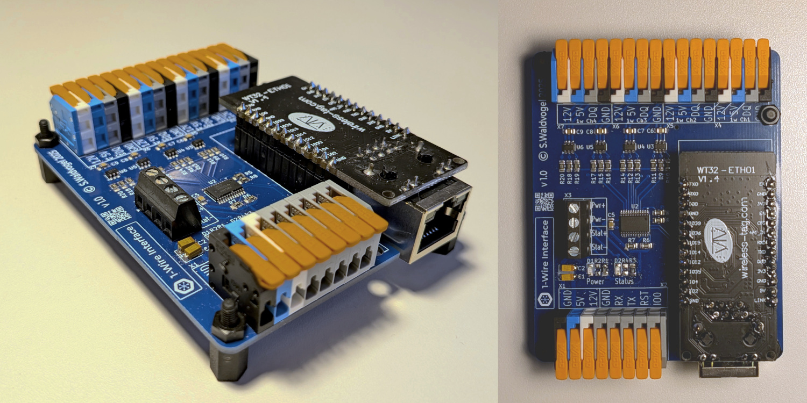
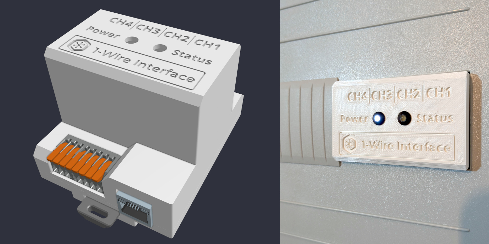
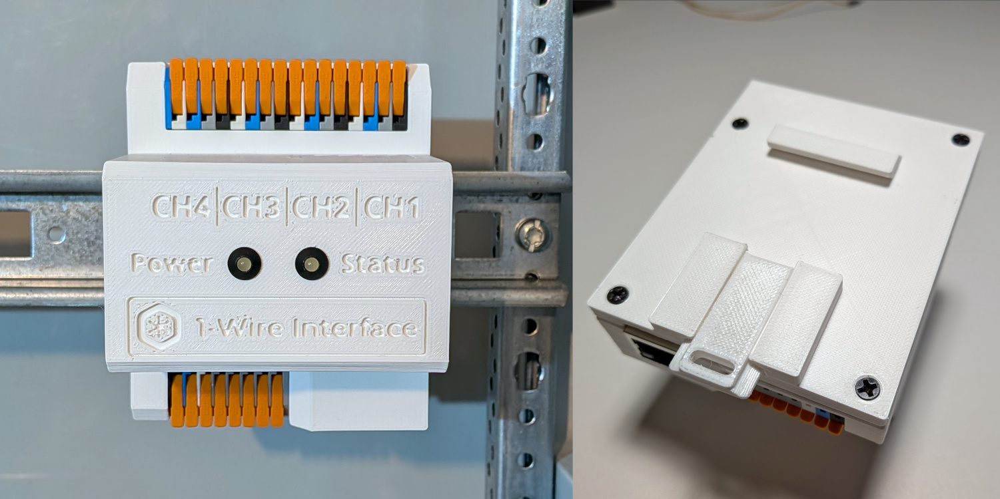
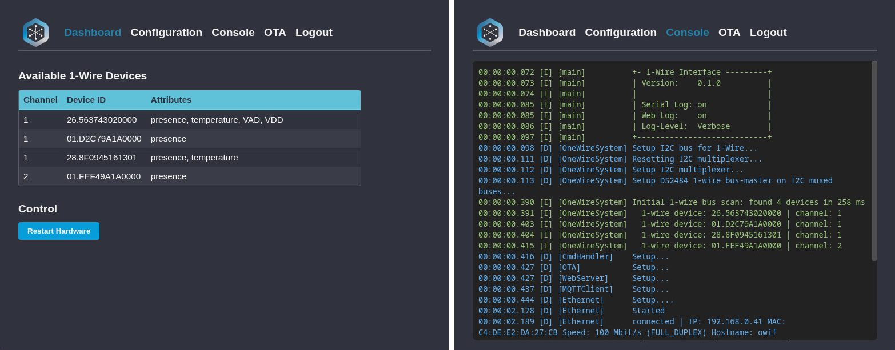

# 

An ESP32-based 1-Wire interface supporting access with physical ethernet and MQTT protocol.

**Overview**



**Hardware**

[](doc/hardware/1w-If_rendering.png)

[](doc/hardware/1w-If_real.jpg)

[](doc/hardware/1w-If_housing1.jpg)

[](doc/hardware/1w-If_housing2.jpg)


[Schematic](doc/hardware/1w-If_schematic.pdf)

## Key Features

* Access 1-wire devices via ethernet / MQTT protocol
* 4 independent 1-Wire channels with hardware bus masters
* Over-the-air (OTA) updates (web interface and espota protocol)
* Responsive web interface for configuration
  <br/>
  
* NTP for clock synchronization
* 3D printed housing

## Supported 1-Wire devices

* DS2401 / DS2411 (Silicon Serial Number)
  * Unique Unique 64-Bit Serial Code

* DS18B20 (Temperature sensor)
  * Configurable resolution temperature

* DS2438  (Smart Battery Monitor)
  * Temperature, VAD, VDD

## Web-Interface

Default login:
- Username: `admin`
- Password: `1w-If`


## MQTT API
`%topic%` is a configurable prefix. Default: `1wIf`

### Commands

General MQTT topic for commands: `%topic%/cmd`

General MQTT topic for responses and status: `%topic%/stat`

Payload Format:

```
{
  "action": "<command>",
  ... action specific parameters / attributes ...
}
```

#### Command 'Restart'

Restart the entire system.
```
{
  "action": "restart",
}
```

Response:
```
{
  "action": "restart",
  "acknowledge": true,
  "time": "2026-02-03 20:20:07.955"
}
```


#### Command 'Scan'

Scan 1-wire buses for all available devices:

```
{
  "action": "scan",
}
```

Scan 1-wire buses for availability of a specific device:

```
{
  "action": "scan",
  "device_id": "01.D2C79A1A0000"
}
```

Scan 1-wire buses for availability of a specific device family:

```
{
  "action": "scan",
  "family_code": 40
}
```

The response lists all available devices and the supported attributes (for `Read` / `Subscribe` / `Unsubscribe` commands):

Example Response:
```
{
  "action": "scan",
  "devices": [
    {
      "channel": 1,
      "device_id": "01.D2C79A1A0000",
      "presence": true,
      "attributes": ["presence"]
    },
    {
      "channel": 1,
      "device_id": "28.8F0945161301",
      "presence": true,
      "attributes": ["presence", "temperature"]
    },
    {
      "channel": 2,
      "device_id": "26.563743020000",
      "presence": true,
      "attributes": ["presence", "temperature", "VAD", "VDD"]
    },
    ...
  ],
  "time": "2026-02-03 20:16:46.010"
}
```

#### Command 'Read'

Read value(s) of a single 1-wire device:

```
{
  "action": "read",
  "device_id": "28.8F0945161301",
  "attribute": "temperature"
}
```

Example Response:
```
{
  "action": "read",
  "device": {
    "channel": 1,
    "device_id": "28.8F0945161301",
    "temperature": 24.75
  },
  "time": "2025-02-03 19:10:07.955"
}
```

Read value(s) of a specific device family:

```
{
  "action": "read",
  "family_code": 40,
  "attribute": "temperature"
}
```

Example Response:
```
{
  "action": "read",
  "family_code": 40,
  "devices": [
    {
      "channel": 1,
      "device_id": "28.8F0945161301",
      "temperature": 24.75
    },
    ...
  ],
  "time": "2025-02-03 18:10:02.844"
}
```

Also the presence of a device can be accessed via the read command using the attribute `presence`.
This is similar to the scan command.

```
{
  "action": "read",
  "device_id": "28.8F0945161301",
  "attribute": "presence"
}
```

Example Response:
```
{
  "action": "read",
  "device": {
    "channel": 2,
    "device_id": "28.8F0945161301",
    "presence": true
  },
  "time": "2026-01-17 05:19:02.170"
}
```


#### Command 'Subscribe / Unsubscribe'

Subscribe to cyclic updates for 1-wire device attributes.
After successful subscription this triggers internally a `Read` command with the configured internal time.

Unit of 'interval': _milliseconds_

```
{
  "action": "subscribe",
  "device_id": "28.8F0945161301",
  "attribute": "temperature",
  "interval": 1000
}
```

Example response acknowledging the successful subscription:
```
{
  "action": "subscribe",
  "acknowledge": true,
  "device": {
    "device_id": "28.8F0945161301"
  },
  "time": "2025-08-05 13:10:22.970"
}
```


Unsubscribe from the attribute:
```
{
  "action": "unsubscribe",
  "device_id": "28.8F0945161301",
  "attribute": "temperature"
}
```

It is also possible to subscribe to the attribute `presence` to get cyclic updates about the availability of dedicated
devices:
```
{
    "action": "subscribe",
    "device_id": "01.D2C79A1A0000",
    "attribute": "presence",
    "interval": 2000
}
```

Example of the `Read` command for attribute `presence` cyclically triggered by the subscription:
```
{
  "action": "read",
  "device": {
     "channel": 3,
     "device_id": "01.D2C79A1A0000",
     "presence": false
  },
  "time": "2026-01-20 14:55:36.781"
}
```

### Last Will and Testament

The MQTT Last Will and Testament (LWT) message is published to the `%topic%/stat` topic.

The LWT contains the attribute `state` with the value `offline`.
It also includes the timestamp of when the LWT was registered with the MQTT broker.

Example:
```
{
  "state": "offline",
  "time": "2026-02-27 21:52:59.016"
}
```

During startup and registration with the MQTT broker, the same message is published with `state` set to `online`.
In this case, the timestamp contains the time of the initial MQTT subscription performed by the 1-Wire interface.

Example:
```
{
  "state": "online",
  "time": "2026-02-27 22:04:17.125"
}
```


## Development

### Firmware
```
cd firmware

# Build firmware
./build.sh

# Flash firmware + LittleFS filesystem
./flash.sh
./flash-fs.sh

# Optional: Monitor via websocket
./monitor.sh
```

Run tests
```
cd test
pdm install --dev

# Create a test_env_config.yaml in the test directory
cp example_test_env_config.yaml test_env_config.yaml
# Adapt all MQTT / device settings test_env_config.yaml
vim test_env_config.yaml

# Execute tests
pdm run tests
# Alternative: with filter
pdm run tests -k "<test name filter>"

# Lint/Format of test implementations
pdm run lint
pdm run format
```

### Hardware

- PCB designed with [KiCad](https://www.kicad.org/)
- Production files created with KiCad plugin [KiCAD JLCPCB tools](https://github.com/Bouni/kicad-jlcpcb-tools)
- Housing designed with [onshape.com](https://www.onshape.com/)

#### 3D Printing Settings

* Bottom / Top Parts:
  * Material: PLA / HPA
  * 0.4mm nozzle
  * Perimeters: 2
  * Infill:
    * General: 15%
    * Screw Domes: 100% concentric
* DIN Rail Clip:
  * Material: PETG
  * 0.4mm nozzle
  * Perimeters: 2
  * Infill:
    * General: 15%
    * Screw Domes: 100% concentric
